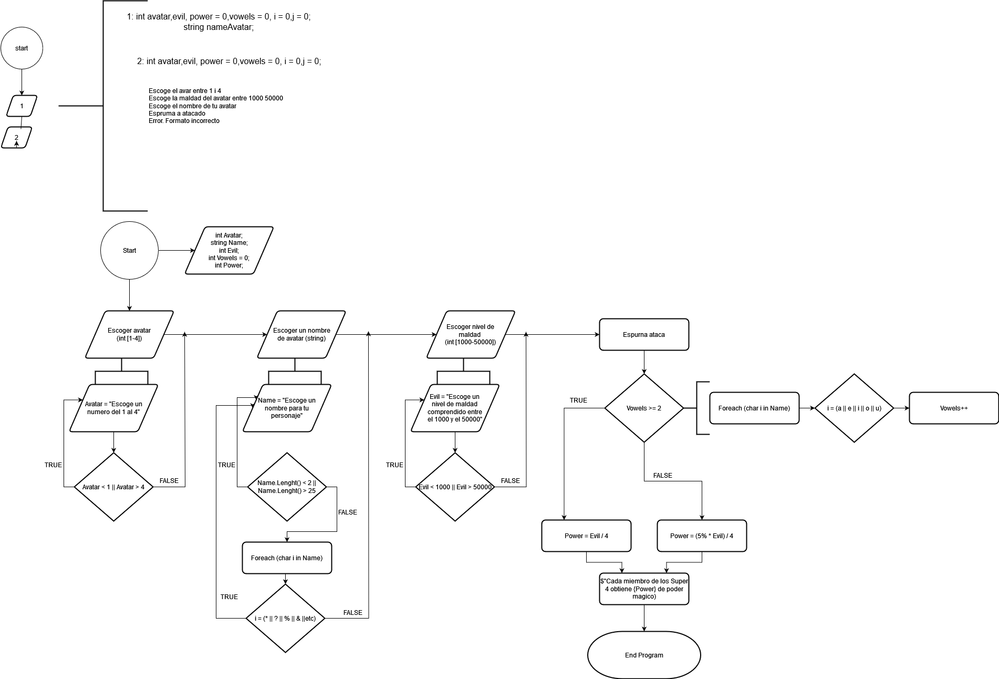

## Pseudocodi

```
program Super4 
    const
        string CHOOSE_AVATAR = "Escoge el avatar entre 1 i 4: ":
        string CHOOSE_EVIL = "Escoge la maldad del avatar entre 1000 i 5000: ";
        string CHOOSE_NAME = "Escoge el nombre de tu avatar: ";
        string ESPURNA_ATTACK = "Espurna ha atacado!";
        string ERROR_MSG = "Error. Formato incorrecto.";
        array[] arrayVowels = ["a", "e", "i", "o", "u"];
    endconst
    var
        int numUser, avatar, evil, power = 0, vowels = 0, i = 0, j = 0;
        string nameAvatar;
    endvar

    function checkInput(min, max, message)
        const string ERROR_MSG = "Error. Formato incorrecto."
        bool isError = false;
        do
            if isError:
                write(ERROR_MSG)
            endif
            write(message);
            input = read();
            isError = true;
        while input > max OR input < min
        endwhile
        isError = false;
        return input;
    endfun

    avatar = checkInput(1, 4, CHOOSE_AVATAR);
    evil = checkInput(1000, 5000, CHOOSE_EVIL);

    do
        if isError then
            write(ERROR_MSG)
        endif
        write(CHOOSE_NAME);
        nameAvatar = read();
        isError = true;
    while nameAvatar.Length > 25 OR nameAvatar.Length < 2
    endwhile

    for i to nameAvatar.Length
        for j arrayVowels.Length
            if nameAvatar[i] == arrayVowels[j] then
                vowels = vowels + 1;
                if vowels == 2 then
                    i = nameAvatar.Length;
                endif
            endif
        endfor
    endfor

    write(ESPURNA_ATTACK);
    if vowels == 2 then
        power = power + evil / 4;
        evil = evil % 4;
    else
        power = power + (evil * 5 / 100) / 4;
        evil = evil - (evil * 5 / 100);
    endif

    write("El poder de cada Super4 es", power);
    write("Al avatar le queda", evil, "de maldad.")
endprogram
```

## Diagrama de flux
